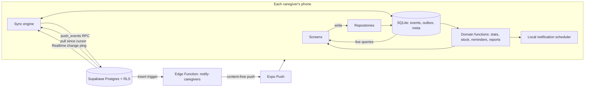
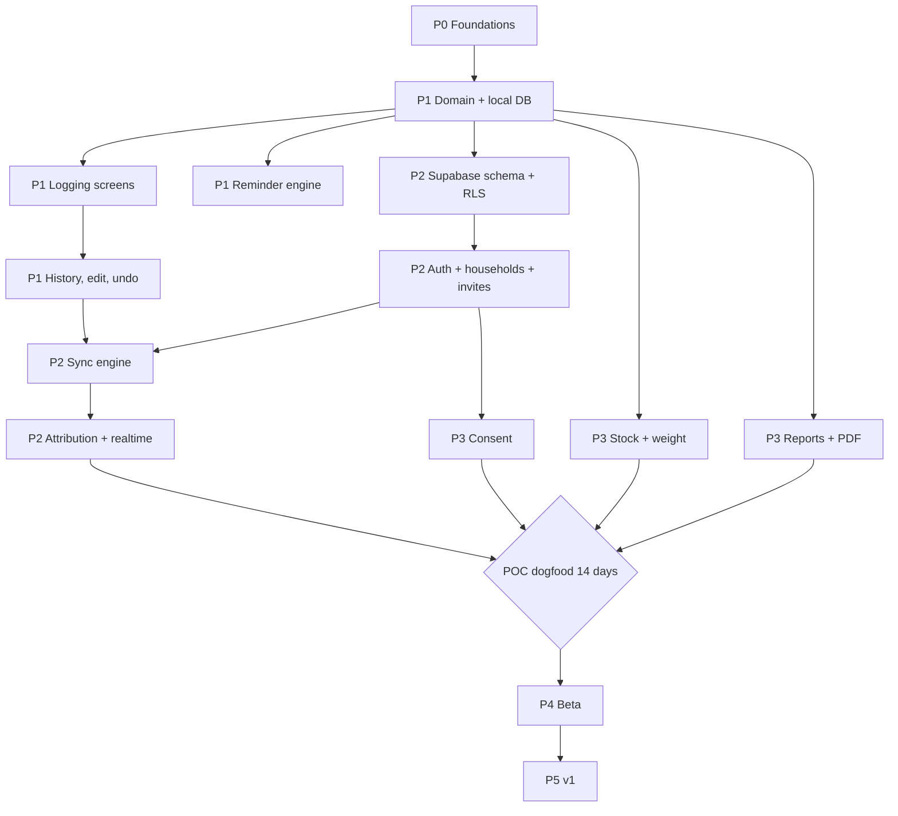

# Software Design Document and Build Plan

App name: **Moraki** (μωράκι, "little one")
Bundle ID: `eu.codedesigns.moraki`
Domain: moraki.app
Version: 0.3, 21 September 2026
Scope source: `01-research-and-poc-scope.md`
Owner: Makis, Code Designs

Changes in 0.3: name finalised as Moraki, replacing the working name and every "Nest" reference. moraki.app registered.
Changes in 0.2: appointments moved into the POC (P3-12), section 15 added on modularity and UI decoupling, ADR-009 and ADR-010 added.

---

## 0. How to use this document

- Sections 1 to 9 are the design. Read them once.
- Section 10 is the build plan. Every commit has an ID (`P2-04`), its dependencies, and a done condition. Work top to bottom inside a phase. Phases are gated.
- Section 11 is the test plan, 12 is compliance, 13 is the ADR log, 15 is the modularity contract.
- When you work with Claude Code, point it at one commit ID at a time and at sections 14 and 15. Copy section 14 into the repo's `CLAUDE.md` at P0-01.

---

## 1. Goals and non-goals

### Goals

1. Answer "when did she last eat, and when is the next feed" in under one second from the lock screen tap.
2. Log a bottle feed in 2 taps and under 5 seconds, one handed.
3. Every caregiver sees the same state. A feed logged by one phone moves the timer and the reminder on every phone.
4. Works fully offline. Syncs when signal returns, with no data loss and no duplicates from retries.
5. Produces the numbers a pediatrician asks for, in the order they ask.
6. Health data stays in the EU and is never shared with third parties.

### Non-goals

Sleep prediction, AI coaching, growth percentiles, milestones, photos, community, payments, web app. The app never interprets data medically.

---

## 2. Stack

| Layer | Choice | Notes |
|---|---|---|
| App | Expo (current SDK at init), React Native, TypeScript strict | Development builds, not Expo Go, from P1 because of notifications and SQLite |
| Routing | Expo Router | File based, typed routes, deep links for invites |
| Local DB | expo-sqlite + Drizzle ORM | SQLite is the source of truth for the UI |
| UI state | Zustand for ephemeral UI state only | Data comes from SQLite queries, not from a store |
| Validation | Zod | One schema per event payload, shared by DB, forms and sync |
| Backend | Supabase, EU region (Frankfurt) | Postgres, Auth (email OTP), Realtime, Edge Functions |
| Notifications | expo-notifications | Local scheduled notifications for feed reminders. Expo push only for caregiver events, content free |
| PDF | expo-print + expo-sharing | HTML template rendered on device |
| i18n | i18next + expo-localization | English at POC, Greek at P4 |
| IDs | UUID v7, generated on the client | Time ordered, safe to create offline |
| Tests | Jest, React Native Testing Library, pgTAP (Supabase CLI), Maestro for E2E | |
| CI/CD | GitHub Actions, EAS Build, EAS Submit, EAS Update | |
| Errors | Sentry, EU data region, PII scrubbing on, no payloads | Added at P4, not before |

Local development runs Supabase through the CLI in Docker. Three Supabase projects: `nest-dev` (optional, shared), `nest-staging`, `nest-prod`, all EU.

---

## 3. Architecture



Three rules hold the design together:

1. The UI only reads SQLite. It never waits on the network.
2. Every write goes to SQLite and the outbox in one transaction, then the sync engine ships it.
3. Everything the home screen shows is a pure function of the event list plus the clock. Stock, stats, reminders and reports are derived, never stored. That makes sync conflict free for everything except edits to the same entry.

---

## 4. Data model

### 4.1 Event sourcing

Almost everything is an `event`. One synced table, one sync path, one set of RLS rules.

| type | occurred_at means | ended_at | payload (Zod schema) |
|---|---|---|---|
| `feed_bottle` | start of feed | optional | `{ ml: int 1..400, milk: 'breast'\|'formula'\|'mixed', from_stock?: 'fridge'\|'freezer' }` |
| `feed_breast` | start of feed | end of feed | `{ side: 'left'\|'right'\|'both', left_s?: int, right_s?: int }` |
| `diaper` | change time | null | `{ kind: 'wet'\|'dirty'\|'both', color?: enum, note?: string ≤280 }` |
| `sleep` | start | null while running | `{ place?: 'crib'\|'bassinet'\|'arms'\|'stroller'\|'other' }` |
| `pump` | session time | optional | `{ ml: int 1..600, dest: 'fridge'\|'freezer'\|'fed' }` |
| `stock_adjust` | adjust time | null | `{ loc: 'fridge'\|'freezer', delta_ml: int, reason: 'discard'\|'move'\|'correction' }` |
| `health` | observation time | null | `{ note: string 1..500, temp_c?: number 34..43, tags?: enum[] }` |
| `medication` | given at | null | `{ name: string ≤60, dose?: string ≤30 }` |
| `weight` | measured at | null | `{ grams: int 500..15000, source: 'home'\|'clinic' }` |
| `appointment` | scheduled for | null | `{ title, doctor?, clinic?, notes?, questions? }` |

A combined bottle plus breast feed is two events that share a `group_id`. The UI shows them as one row.

### 4.2 Postgres schema

```sql
create table households (
  id uuid primary key,
  name text not null,
  reminder_interval_min int not null default 180 check (reminder_interval_min between 60 and 480),
  second_reminder_min int check (second_reminder_min between 15 and 120),
  created_by uuid not null references auth.users,
  created_at timestamptz not null default now()
);

create type member_role as enum ('owner','caregiver','viewer');

create table memberships (
  household_id uuid references households on delete cascade,
  user_id uuid references auth.users on delete cascade,
  role member_role not null,
  display_name text not null check (length(display_name) between 1 and 40),
  relation text check (relation in ('mother','father','grandparent','caregiver','other')),
  joined_at timestamptz not null default now(),
  primary key (household_id, user_id)
);

create table babies (
  id uuid primary key,
  household_id uuid not null references households on delete cascade,
  name text not null,
  born_at timestamptz not null,
  birth_weight_g int check (birth_weight_g between 500 and 7000),
  birth_length_mm int,
  head_circ_mm int,
  updated_at timestamptz not null default now(),
  deleted_at timestamptz
);

create sequence event_seq;

create table events (
  id uuid primary key,                 -- client generated UUID v7
  household_id uuid not null references households on delete cascade,
  baby_id uuid not null references babies on delete cascade,
  type text not null,
  occurred_at timestamptz not null,
  ended_at timestamptz,
  payload jsonb not null default '{}',
  group_id uuid,
  created_by uuid not null references auth.users,
  updated_by uuid not null references auth.users,
  client_created_at timestamptz not null,
  server_updated_at timestamptz not null default now(),
  deleted_at timestamptz,
  seq bigint not null default nextval('event_seq')
);
create index events_pull on events (household_id, seq);
create index events_time on events (baby_id, occurred_at desc) where deleted_at is null;

create table invites (
  code text primary key,               -- 8 chars, no ambiguous characters
  household_id uuid not null references households on delete cascade,
  role member_role not null default 'caregiver',
  created_by uuid not null references auth.users,
  expires_at timestamptz not null,
  used_by uuid references auth.users,
  used_at timestamptz
);

create table consents (
  user_id uuid references auth.users on delete cascade,
  policy_version text not null,
  granted_at timestamptz not null default now(),
  withdrawn_at timestamptz,
  primary key (user_id, policy_version)
);

create table push_tokens (
  user_id uuid references auth.users on delete cascade,
  device_id text not null,
  token text not null,
  platform text not null check (platform in ('ios','android')),
  caregiver_alerts boolean not null default false,
  updated_at timestamptz not null default now(),
  primary key (user_id, device_id)
);
```

A trigger on `events` update sets `seq = nextval('event_seq')` and `server_updated_at = now()`. Every change gets a new sequence number, so pull by cursor never misses an edit.

### 4.3 Row level security

```sql
create function is_member(h uuid) returns boolean language sql stable security definer as $$
  select exists (select 1 from memberships where household_id = h and user_id = auth.uid())
$$;
create function can_write(h uuid) returns boolean language sql stable security definer as $$
  select exists (select 1 from memberships where household_id = h and user_id = auth.uid()
                 and role in ('owner','caregiver'))
$$;
```

| Table | select | insert | update | delete |
|---|---|---|---|---|
| households | member | any signed-in user (becomes owner by RPC) | owner | owner, through RPC only |
| memberships | member | RPC only (`accept_invite`, `create_household`) | owner, or self for display_name | owner, or self (leave) |
| babies | member | writer | writer | never, soft delete |
| events | member | writer, `created_by = auth.uid()` | writer | never, soft delete |
| invites | owner | owner | none | owner |
| consents, push_tokens | self | self | self | self |

pgTAP tests cover every cell of this table in P2.

### 4.4 Local SQLite schema

Mirrors `babies`, `events` and `memberships`, plus:

```sql
create table outbox (
  id integer primary key autoincrement,
  entity text not null,           -- 'event' | 'baby'
  entity_id text not null,
  op text not null,               -- 'insert' | 'patch' | 'delete'
  body text not null,             -- JSON
  attempts integer not null default 0,
  last_error text,
  created_at integer not null
);
create table meta (key text primary key, value text not null);  -- pull cursor, household id, user id
```

---

## 5. Sync design

### 5.1 Write path

1. Screen calls a repository, for example `events.logBottle({ ml: 90, milk: 'breast' })`.
2. In one SQLite transaction: insert the event, insert an outbox row.
3. Live queries rerender. The reminder scheduler reruns.
4. The sync engine wakes and pushes.

### 5.2 Push

`push_events(ops jsonb)` is a Postgres function running as the caller, so RLS applies. It processes ops in order:

- `insert`: `insert ... on conflict (id) do nothing`. Retries are safe.
- `patch`: `payload = payload || $patch`, plus the top-level fields sent (`occurred_at`, `ended_at`). Last write wins per field, in server arrival order.
- `delete`: sets `deleted_at` if null. Delete is final. A later patch to a deleted event is ignored.

It returns the ids it applied and any rejected with a reason. Rejected ops (RLS, validation) are moved out of the outbox into a `sync_errors` view in Settings. They are never retried forever.

Batching: up to 100 ops per call. Backoff on network failure: 2s, 5s, 15s, 60s, then every 5 minutes, reset on reconnect or foreground.

### 5.3 Pull

```sql
select * from events where household_id = $1 and seq > $cursor order by seq limit 500
```

Repeat until fewer than 500 rows. Upsert locally. Local rows with a pending outbox op keep their local values for the fields that op touches, so an unsent edit isn't overwritten by an older server copy. Save the new cursor.

### 5.4 Triggers for pull

- Realtime `postgres_changes` on `events` filtered by `household_id`. The message is only a ping. The engine always pulls, never trusts the payload.
- App comes to the foreground.
- Network comes back.
- After every successful push.
- Every 60 seconds while the app is open, as a safety net.

### 5.5 Convergence guarantee

Every event has one id, made once, on one device. Inserts are idempotent. Derived state is computed from the full event list. So two phones that have pulled the same `seq` show the same screen. The sync property test in section 11 checks this with random interleavings.

### 5.6 Duplicate detection

When a pull brings in a feed from another caregiver within 5 minutes of a local feed of the same kind, the home screen shows "Andreas also logged a feed at 03:14. Same feed?" with Keep both and Remove mine. Never merged automatically.

---

## 6. Domain logic

All of these live in `src/domain`, are pure TypeScript, take `(events, now, tz)` and have unit tests. No React, no SQLite imports.

### 6.1 Home state

```ts
type HomeState = {
  lastFeed: FeedEvent | null;          // latest non-deleted feed_bottle or feed_breast by occurred_at
  sinceLastFeedMs: number | null;
  nextSide: 'left' | 'right' | null;   // opposite of last breast side, null if none in 24h
  reminderAt: Date | null;             // lastFeed.occurred_at + interval
  secondReminderAt: Date | null;
  today: { feeds: number; ml: number; wet: number; dirty: number; sleepMs24h: number };
  activeSleep: SleepEvent | null;
  stock: { fridgeMl: number; freezerMl: number; oldestFridgeAt: Date | null; oldestFreezerAt: Date | null };
  lastEntry: { type: string; by: string; at: Date } | null;
};
```

"Today" means since local midnight in the device timezone. "24h" means the last 24 hours. Each label in the UI says which one it is.

### 6.2 Reminder engine

```
on any change to events or settings:
  cancel notifications with category 'feed'
  if reminders are on for this user on this device:
    r = lastFeed.occurred_at + interval
    if r > now: schedule "Next feed may be due" at r
    if secondReminder and r + second > now: schedule "No feed logged since 02:30" at r + second
```

Each phone schedules its own local notifications, so the reminder fires with no signal and no server. Because every phone runs the same function on the same events, all caregivers get the same time. Per user, per device switch: a grandparent can turn reminders off without affecting anyone else.

Copy for the notification body never contains amounts or health data. It shows on a lock screen.

### 6.3 Milk stock

Stock is a fold over events, FIFO:

- `pump` with dest fridge or freezer adds a batch
- `feed_bottle` with `from_stock` takes from the oldest batch in that location
- `stock_adjust` adds or removes

Because stock is derived, two caregivers taking milk at the same time can't corrupt it. Stock can go below zero if people log out of order. The UI shows 0 and a small "check stock" link that opens an adjust sheet.

### 6.4 Weight regain view

Input: birth weight and weight events. Output: a series of `{ day, grams, pctOfBirth }` and two reference lines, 90% and 100% of birth weight, with markers at day 10 and day 14. No colour coding of good or bad, no text judging the numbers. The only copy is "Your pediatrician tracks this at check-ups."

### 6.5 Reports and the call script

`buildReport(events, baby, range, now, tz)` returns a plain object. The screen and the PDF template both render it.

Call script order, taken from what clinicians ask:

1. Baby's age in days
2. Birth weight, latest weight and date, change in grams and percent
3. Feeds in the last 24 hours, total mL, longest gap
4. Wet diapers and dirty diapers in the last 24 hours
5. Last temperature, if any, with time
6. Health notes and medication in the range
7. Free text: "What I'm worried about" (typed by the parent, not saved unless they choose)

The 3 day and 7 day summaries add per-day rows, average bottle, average interval, sleep total and the event list.

### 6.6 Time rules

- Store UTC. Convert at the edge of the UI.
- Durations are differences of epoch milliseconds, never wall clock arithmetic.
- Day buckets use the device timezone at render time.
- Timer display: under an hour `42m`, otherwise `2h 18m`. Never seconds on the home card.
- Tests run under `TZ=Europe/Nicosia`, `TZ=UTC` and `TZ=America/New_York`, and across the Nicosia DST change on 25 October 2026.

---

## 7. Screens

| Route | Purpose | Notes |
|---|---|---|
| `(tabs)/index` | Home | Timer card, next side, reminder line, Log feed, 5 quick actions, today strip, stock, next appointment, recent 6 |
| `(tabs)/history` | Timeline | Filter chips, grouped by day, tap row to edit |
| `(tabs)/insights` | Trends | 7 day milk chart, averages, diapers, sleep, weight view |
| `(tabs)/settings` | Settings | Baby, reminders, caregivers, invite, night mode, report, privacy, sync status |
| `log/feed`, `log/diaper`, `log/sleep`, `log/pump`, `log/health`, `log/weight` | Modal sheets | Prefilled with now and last used values |
| `entry/[id]` | Edit sheet | Time, amount, note, delete |
| `report/[range]` | Report preview | Share as PDF |
| `report/call` | Call script | Large type, one screen |
| `onboarding/*` | First run | Sign in, consent, create or join household, baby details |
| `join/[code]` | Invite deep link | Accepts invite after sign in and consent |

Logging budget: bottle feed from home is Log feed, then Save. The sheet opens with last amount and milk type and the current time. Two taps.

Night mode: automatic between 21:00 and 06:00 local, or forced on or off. Dark warm palette, no pure white, largest text sizes kept.

Every entry row shows the author: "Andreas" or "You".

---

## 8. Non-functional requirements

| Area | Requirement |
|---|---|
| Speed | Cold start to home under 2s on a mid-range Android. Log sheet opens under 150ms |
| Offline | Every feature except invite and sign-in works with no network, for any length of time |
| Sync | Online, a feed on phone A shows on phone B within 3 seconds at p95 |
| Reliability | Zero data loss across app kill, reboot, airplane mode and reinstall after sync |
| Accessibility | Touch targets at least 48dp, WCAG AA contrast in both themes, Dynamic Type and font scale up to 200%, screen reader labels on every control |
| Battery | No background location. No polling while backgrounded |
| Security | Supabase session in SecureStore. SQLite not encrypted at POC (device encryption covers it), SQLCipher reviewed at P5 |
| Privacy | No third party SDKs that receive health data. No ad SDKs. No analytics at POC |

---

## 9. Repository layout

```
nest/
  app/                      Expo Router routes (thin: layout and wiring only)
  src/
    domain/                 pure logic: types, zod schemas, home, stock, reminders, reports, duplicates, time
    db/                     drizzle schema, local migrations, repositories
    sync/                   outbox, push, pull, realtime, backoff
    notifications/          scheduler, permissions, categories
    features/               feed, diaper, sleep, pump, health, weight, household, report, onboarding
    ui/                     tokens, theme, primitives (Card, Sheet, Stepper, Segmented, Chip, Timer)
    i18n/                   en.json, el.json
  supabase/
    migrations/             numbered SQL
    functions/              notify-caregivers, export-data, delete-household
    tests/                  pgTAP
  e2e/                      Maestro flows
  docs/                     this file, research, ADRs, DPIA
  CLAUDE.md
```

---

## 10. Build plan

### 10.1 Phase overview

| Phase | Outcome | Gate to move on | Rough effort (focused hours) |
|---|---|---|---|
| P0 Foundations | Empty app builds and runs on both phones, CI green | Dev build installed on an iPhone and an Android | 10 to 14 |
| P1 Core logging, one phone | Full logging, home, history, undo, edit, reminders, night mode, all offline | You use it alone for 3 days without paper backup | 35 to 45 |
| P2 Households and sync | Two phones, one baby, live sync, invites, attribution | Two phones in airplane mode log 20 entries each, reconnect, both screens match | 30 to 40 |
| P3 POC complete | Weight, stock, reports, call script, PDF, consent | 14 day household dogfood starts | 25 to 30 |
| P4 Beta | Hardening, caregiver alerts, appointments, Greek, export and delete, store test tracks | 5 households recruited and onboarded | 35 to 45 |
| P5 v1 | Store release, privacy policy, widgets or Live Activity, pricing decision | Beta retention criteria met (see research doc section 6) | 30 to 50 |

POC is P0 to P3, roughly 100 to 130 focused hours. At 10 hours a week that's 10 to 13 weeks. If this has to be ready for a due date, P1 alone gives you a working single phone tracker, and P2 is the minimum for two parents.

### 10.2 Dependency graph



### 10.3 Commits

Format: `ID · conventional commit message · depends on · done when`. One commit is one reviewable change. If a commit grows past about 400 changed lines, split it.

#### P0 Foundations

| ID | Commit | Depends | Done when |
|---|---|---|---|
| P0-01 | `chore: init expo app with typescript strict, expo-router, CLAUDE.md` | none | `npx expo start` runs, strict TS, engineering rules copied into CLAUDE.md |
| P0-02 | `chore: add eslint, prettier, husky, lint-staged, commitlint` | P0-01 | pre-commit blocks a lint error |
| P0-03 | `chore: add jest with rntl and a sample domain test` | P0-01 | `npm test` green |
| P0-04 | `ci: github actions for lint, typecheck, test` | P0-02, P0-03 | PR shows three green checks |
| P0-05 | `feat(ui): design tokens, light and night themes, typography scale` | P0-01 | tokens file, theme provider, one sample screen in both themes |
| P0-06 | `feat(ui): primitives Card, Sheet, Stepper, Segmented, Chip, Button, TimerText` | P0-05 | storybook-style demo route renders all primitives |
| P0-07 | `feat(i18n): i18next with en locale and typed keys` | P0-01 | no hardcoded strings lint rule on |
| P0-08 | `chore(supabase): init supabase project folder, local docker, env handling` | P0-01 | `supabase start` works, `.env.example` committed |
| P0-09 | `build: eas config with development, preview, production profiles` | P0-01 | dev build installed on your iPhone and an Android |

#### P1 Core logging, one phone

| ID | Commit | Depends | Done when |
|---|---|---|---|
| P1-01 | `feat(domain): event types, zod payload schemas, activity module registry` | P0-03 | every type in 4.1 has a schema with valid and invalid tests, and the registry completeness test in 15.3 passes |
| P1-02 | `feat(domain): time utils (duration format, day buckets, tz safe)` | P0-03 | tests pass under three TZ values and across the 25 Oct DST change |
| P1-03 | `feat(db): drizzle sqlite schema, local migrations, outbox, meta` | P1-01 | migrations run on fresh install and on upgrade |
| P1-04 | `feat(db): events repository with insert, patch, softDelete writing outbox in one transaction` | P1-03 | tests prove event and outbox rows commit or roll back together |
| P1-05 | `feat(domain): home state selector` | P1-01, P1-02 | tests cover no feeds, one feed, breast then bottle, deleted last feed, active sleep |
| P1-06 | `feat(home): timer card, next side, reminder line, today strip, recent list` | P0-06, P1-04, P1-05 | timer ticks every 30s, updates instantly on log |
| P1-07 | `feat(log): feed sheet (bottle, breast, mixed) with last-used prefill` | P1-04, P0-06 | bottle feed in 2 taps from home |
| P1-08 | `feat(log): diaper sheet, one tap save` | P1-04 | wet, dirty, both each save in one tap from the sheet |
| P1-09 | `feat(log): sleep start, stop, manual entry, running sleep card` | P1-04 | running sleep survives app kill |
| P1-10 | `feat(log): health note and medication sheets` | P1-04 | temp range validated, note length capped |
| P1-11 | `feat(history): timeline grouped by day with filters` | P1-04 | 2,000 events scroll at 60fps on the Android test phone |
| P1-12 | `feat(entry): edit sheet and delete, undo toast on every save` | P1-04, P1-11 | undo within 6s restores exact prior state |
| P1-13 | `feat(domain): reminder computation` | P1-05 | tests for recalculation on new feed, edit of last feed, delete of last feed, second reminder |
| P1-14 | `feat(notifications): permission flow and local scheduler bound to reminder computation` | P1-13, P0-09 | on a real phone: log feed, lock, notification arrives at the right minute, relog moves it |
| P1-15 | `feat(settings): reminder interval, second reminder, per-device reminders toggle` | P1-14 | changing interval reschedules immediately |
| P1-16 | `feat(ui): night mode auto, on, off` | P0-05 | switches at 21:00 and 06:00 without restart |
| P1-17 | `feat(insights): 7 day milk chart, averages, diaper and sleep counts` | P1-05 | numbers match a hand-checked fixture |
| P1-18 | `test(e2e): maestro flows for log feed, log diaper, undo, edit` | P1-12 | flows pass on both simulators in CI or locally |

#### P2 Households and sync

| ID | Commit | Depends | Done when |
|---|---|---|---|
| P2-01 | `feat(db-server): migrations for households, memberships, babies, events, invites, seq trigger` | P0-08 | `supabase db reset` builds schema from zero |
| P2-02 | `feat(db-server): rls policies and helper functions` | P2-01 | policies match table 4.3 |
| P2-03 | `test(db-server): pgtap tests for every rls cell` | P2-02 | a viewer can't insert, a stranger can't select, CI runs them |
| P2-04 | `feat(auth): email otp sign in, session in securestore` | P0-08 | sign in, kill app, still signed in |
| P2-05 | `feat(household): create_household rpc and onboarding flow with baby details` | P2-02, P2-04 | new user ends on home with an empty baby |
| P2-06 | `feat(household): invites, create code, share link, accept_invite rpc, join route` | P2-05 | second phone joins through the link, role applied |
| P2-07 | `feat(sync): push_events rpc with insert, patch, delete semantics` | P2-02 | SQL tests for idempotent insert, per-field patch, delete wins |
| P2-08 | `feat(sync): client push with batching, backoff, rejected-op handling` | P1-04, P2-07 | outbox drains, rejected ops appear in sync status |
| P2-09 | `feat(sync): client pull by cursor with pending-op protection` | P2-08 | unsent local edit survives a pull of an older server copy |
| P2-10 | `feat(sync): realtime ping, foreground, reconnect and interval triggers` | P2-09 | phone B updates within 3s of phone A |
| P2-11 | `feat(sync): migrate local-only data into a new household on first sign in` | P2-09 | a P1 user keeps all history after signing up |
| P2-12 | `feat(home): author on every row, last entry by line, caregivers list` | P2-06, P2-10 | rows read "You" or the other person's name |
| P2-13 | `feat(settings): sync status screen with pending count, last sync, errors` | P2-08 | visible pending count goes to zero when online |
| P2-14 | `test(sync): convergence property test with random interleavings` | P2-09 | 1,000 random runs, two simulated clients, identical derived state |
| P2-15 | `test(manual): two phone airplane mode checklist in docs` | P2-10 | checklist passes and is committed |

#### P3 POC complete

| ID | Commit | Depends | Done when |
|---|---|---|---|
| P3-01 | `feat(domain): milk stock fold, fifo, oldest batch age` | P1-01 | tests for pump in, take out, adjust, negative clamp |
| P3-02 | `feat(log): pump sheet and from-stock option on bottle feed` | P3-01, P1-07 | fridge total drops on both phones after a feed |
| P3-03 | `feat(home): stock card with adjust sheet` | P3-02 | adjust reason saved |
| P3-04 | `feat(domain): weight series and regain view model` | P1-01 | tests with a real-shaped day 0 to 21 fixture |
| P3-05 | `feat(insights): weight log and regain chart` | P3-04 | reference lines at 90% and 100%, day 10 and 14 markers, no judging copy |
| P3-06 | `feat(domain): report builder for call script, 24h, 3d, 7d` | P1-05, P3-04 | snapshot tests of report objects |
| P3-07 | `feat(report): call script screen in large type` | P3-06 | readable at arm's length, night mode supported |
| P3-08 | `feat(report): pdf template and share` | P3-06 | PDF opens on iOS and Android share sheets, one page for 24h |
| P3-09 | `feat(privacy): consent screen, versioned consent rpc, block health writes without consent` | P2-04 | no event can sync for a user without a consent row |
| P3-10 | `docs: in-app medical disclaimer and copy review against never list` | P3-07 | every string checked, no advice language |
| P3-12 | `feat(appointments): add, edit, home card, questions list, reminders day-before and 1h before` | P1-04, P1-14 | appointment shows on both phones, both reminders fire on a real device |
| P3-13 | `feat(report): questions-to-ask pulled into the call script` | P3-07, P3-12 | questions saved on the next appointment appear at the end of the script |
| P3-11 | `release: preview builds to both phones, start 14 day dogfood` | all P3 | both caregivers logging, diary of issues opened |

Dogfood gate: run 14 days. Log every friction point as a GitHub issue labelled `dogfood`. Fix the ones that caused a missed or doubled log before P4.

#### P4 Beta

| ID | Commit | Depends |
|---|---|---|
| P4-01 | `feat(sync): duplicate feed detection banner` | P2-10 |
| P4-02 | `feat(push): push token registration and notify-caregivers edge function, content free, opt-in` | P2-10 |
| P4-03 | `chore(arch): enforce layer boundaries with eslint import rules and dependency-cruiser in CI` | P3-12 |
| P4-04 | `feat(i18n): greek locale and date formats, language switch` | P0-07 |
| P4-05 | `feat(privacy): export all household data as json and csv` | P2-09 |
| P4-06 | `feat(privacy): leave household, delete account, delete household with cascade` | P2-06 |
| P4-07 | `feat(household): roles management, remove caregiver, viewer role UI` | P2-06 |
| P4-08 | `chore(obs): sentry eu region, pii scrubbing, no breadcrumbs with payloads` | P0-09 |
| P4-09 | `feat(onboarding): first run polish, empty states, permission explanations` | P2-05 |
| P4-10 | `feat(settings): baby profile edit, multiple babies in schema only` | P2-05 |
| P4-11 | `docs: dpia, records of processing, retention policy, processor list` | P3-09 |
| P4-12 | `build: testflight and play internal testing tracks, eas update channel` | P0-09 |
| P4-13 | `feat(feedback): in-app feedback form to a supabase table, no third party` | P2-04 |

#### P5 v1

| ID | Commit | Depends |
|---|---|---|
| P5-01 | `feat(ios): live activity for time since last feed` (native module via config plugin) | P1-05 |
| P5-02 | `feat(widgets): home screen widget ios and android` | P1-05 |
| P5-03 | `feat(security): sqlcipher evaluation and decision recorded as ADR` | P1-03 |
| P5-04 | `feat(account): sign in with apple and google` | P2-04 |
| P5-05 | `feat(billing): decision implemented (see ADR-008)` | beta results |
| P5-06 | `docs: privacy policy, terms, store listing copy, screenshots` | P4-11 |
| P5-07 | `release: production submit to app store and play` | all |

### 10.4 Branching and release

- Trunk based. `main` is always releasable. Short branches named after the commit ID, `p2-07-push-rpc`.
- Every merge runs lint, typecheck, unit, pgTAP.
- Supabase migrations are applied to staging on merge to `main`, to production only by manual workflow.
- App versions: preview builds per phase, `eas update` for JS-only fixes during beta, store builds for native changes.

---

## 11. Test plan

| Level | What | Tool | Target |
|---|---|---|---|
| Domain unit | home state, reminders, stock, weight, reports, time | Jest | 90% line coverage on `src/domain` |
| Time | every domain test re-run under 3 timezones and the DST change | Jest with `TZ` env matrix | green in CI |
| Repository | transactionality of event and outbox writes | Jest with an in-memory SQLite driver | green |
| Server | RLS every cell, push_events semantics | pgTAP via Supabase CLI | green in CI |
| Sync property | random ops on 2 or 3 simulated clients, random push and pull order, then compare derived state | Jest with fast-check | 1,000 runs green |
| E2E | log feed, diaper, undo, edit, invite join, offline log then sync | Maestro | green before each preview release |
| Manual | two real phones, airplane mode, app kill, reboot, low battery mode | Checklist in `docs/` | signed off per phase |
| Notifications | real device only: fires on time, moves on relog, silent when disabled | Manual checklist | signed off per phase |

---

## 12. Privacy, safety and compliance

### 12.1 GDPR

- Lawful basis: Article 6(1)(b) for running the service, and Article 9(2)(a) explicit consent for health data about the baby. Consent is asked of every caregiver, on its own screen, not bundled with terms, stored with a policy version. Withdrawing consent stops sync for that user and offers export and deletion.
- The parents consent for the baby as holders of parental responsibility. The viewer role doesn't write data but still consents, because they read it.
- Data minimisation: no location, no contacts, no photos at POC. Display names, not legal names.
- Hosting: Supabase EU region. Sign Supabase's DPA before any outside household joins.
- Processors list: Supabase (database, auth), Expo (build service, push relay with content-free messages), Apple and Google (push delivery), Sentry EU from P4. Nothing else.
- Rights: export (P4-05), deletion (P4-06), correction (edit on every entry already).
- Retention: households with no activity for 24 months are warned by email and deleted after 30 more days.
- DPIA: written at P4-11, before the first outside household. Health data about children at any scale is a strong trigger, so treat it as required.
- Records of processing kept in `docs/compliance/`.

Get a short review from a Cyprus data protection lawyer before P5. This plan follows the regulation's structure but it isn't legal advice.

### 12.2 Medical device boundary

EU MDR can classify software as a medical device when it provides information used for diagnosis or treatment decisions. The app stays clear of that by recording and summarising only: no thresholds turned into warnings, no colour coded "normal" ranges, no recommendations. Any future feature that interprets data needs a regulatory check first. This goes into ADR-006 and the copy review in P3-10.

### 12.3 Copy rules

Allowed: counts, times, durations, what a caregiver typed, "Ask your pediatrician about feeding intervals."
Never: "normal", "healthy", "too little", "concerning", "your baby should", any traffic-light colour on a health number.

---

## 13. Architecture decision log

| ADR | Decision | Reason | Revisit when |
|---|---|---|---|
| 001 | Expo React Native, not PWA or fully native | Reliable local notifications and a path to widgets and Live Activities from one codebase | Watch app becomes a priority |
| 002 | Supabase EU over Laravel API | Auth, RLS and Realtime ready made, solo capacity | Egress or pricing hurts, or need server jobs Supabase can't do |
| 003 | Custom event sync over PowerSync or ElectricSQL | One mostly append-only table makes custom sync small and fully understood | Sync code passes 800 lines or conflicts get complex. PowerSync is the fallback |
| 004 | Event sourcing with derived stock and stats | Conflict-free for concurrent caregivers | Event counts per baby exceed 50k (not expected in 90 days) |
| 005 | Local notifications for reminders, server push only for caregiver alerts | Fires offline, no health data leaves the device in a push | Never, this is core |
| 006 | No interpretation of health data | Stay outside medical device rules, avoid harm | Only with regulatory advice |
| 007 | Email OTP only at POC | Fastest to build, no App Store requirement for Apple sign in | P5 |
| 008 | Pricing | Deferred until beta retention is known. Leading option: free logging and sync for all caregivers, paid reports and widgets | After P4 |
| 009 | Activity module registry instead of type switches | New activity types (bath, tummy time, vaccination, mother's recovery) cost one file, not edits across the app | If a module needs to change another module's behaviour |
| 010 | Appointments in the POC, not the beta | They were in the original brief, the notification layer already exists at that point, and the questions list feeds the call script. About 4 hours | Never |

---

## 14. Engineering rules (copy into CLAUDE.md)

1. The UI reads SQLite only. No screen awaits a network call to render.
2. Every write goes through a repository that writes the event and the outbox in one transaction.
3. Domain code in `src/domain` is pure: no React, no SQLite, no `Date.now()`. Pass `now` and `tz` in.
4. Never store derived values (totals, stock, next reminder). Compute them.
5. Store UTC, render local. Durations use epoch milliseconds.
6. Every event payload has a Zod schema. Parse on write and on pull.
7. Never hard delete an event from the client. Soft delete only.
8. No health data in notification text, logs, Sentry events or analytics.
9. No user-facing string outside `src/i18n`.
10. No copy that interprets health data. See 12.3.
11. Every RLS change ships with pgTAP tests in the same commit.
12. One commit ID per branch, conventional commit messages, under about 400 changed lines.

---

## 15. Modularity and change tolerance

Two things have to stay cheap to change: adding a new kind of thing to track, and redesigning the whole interface. Sections 15.1 and 15.2 make each of those a local change instead of a sweep through the codebase.

### 15.1 Layers and the dependency rule

Dependencies point inward only. Nothing ever points back out.

```
app/          routes, navigation, composition only
  ↓
features/     screens and hooks for one area
  ↓
ui/           tokens and primitives (knows nothing about babies)
  ↓
sync/         outbox, push, pull
  ↓
db/           sqlite, repositories
  ↓
domain/       pure logic. imports nothing from this list
```

- `domain/` imports no React, no SQLite, no navigation, no `Date.now()`.
- `ui/` imports no feature, no repository and no domain type. It takes props.
- A feature never imports another feature. Shared behaviour moves down into `domain/` or `ui/`.
- Enforced by eslint `import/no-restricted-paths` plus dependency-cruiser in CI (P4-03). A violation fails the build.

### 15.2 The activity module contract

Every trackable thing is a module that declares everything about itself. Nothing outside a module branches on event type.

```ts
export type ActivityModule<P> = {
  type: EventType;                                   // 'feed_bottle'
  schema: ZodType<P>;                                // validation for forms, writes and pulls
  i18nKey: string;                                   // label, never a literal string
  icon: IconName;
  quickAction?: { order: number };                   // appears on the home grid
  LogSheet: ComponentType<LogSheetProps<P>>;         // its own form
  summarize: (e: Event<P>) => { title: string; detail?: string };  // history and home rows
  contributes?: {
    stats?: (acc: Stats, e: Event<P>) => Stats;      // today strip and insights
    stock?: (acc: Stock, e: Event<P>) => Stock;      // milk stock fold
    report?: (events: Event<P>[], range: Range) => ReportSection | null;
  };
  reminders?: (events: Event<P>[], settings: Settings, now: number) => ScheduledReminder[];
};

registerActivity(feedBottleModule);
```

Adding bath, tummy time, vaccinations, solids or the mother's recovery module is one new file plus one `registerActivity` call. The home grid, the history rows, the filters, the stats, the reports and the reminders all pick it up.

Rules:

- `switch (event.type)` and `if (type === ...)` are banned outside `domain/activities/`. Lint rule, not a convention.
- A module never imports another module. If two need the same logic, it moves to `domain/`.
- New event types are additive only. Never rename or repurpose a type string, because old events live on other people's phones forever. Deprecate instead.

### 15.3 Registry completeness test

One test walks the registry and fails if any module is missing a schema, an i18n key in every shipped locale, a `summarize`, or a round-trip test fixture. This is what stops a half-wired module reaching a phone.

### 15.4 Keeping the UI replaceable

The interface is the part most likely to be thrown away, so nothing important lives in it.

- **Tokens.** One data file: colour, spacing, radius, type scale, motion. No component contains a hex value, a pixel number or a font name.
- **Primitives.** `Card`, `Sheet`, `Stepper`, `Segmented`, `Button`, `TimerText`, `Chip`. Dumb, styled only from tokens.
- **Headless hooks.** `useHome()` returns the finished view model. `HomeScreen` renders it and does nothing else. Same for `useHistory()`, `useInsights()`, `useReport(range)`.
- **Copy** lives in i18n files, so rewording never touches code.

A full redesign, or a stripped-back simpler version, is then a rewrite of `ui/` and `app/` only. Domain, db and sync are untouched and every domain test still passes. The same property makes a second surface cheap later: a web view for grandparents, or a watch app, reuses domain and sync as they are.

What breaks this if you let it: a SQLite call inside a component, date maths inside a component, or a literal string in JSX. Those three cover nearly every leak.

### 15.5 Scale points already handled, and the ones to watch

Handled in the design: `baby_id` on every event (multiple babies without a migration), `household_id` on every row (families and later daycares), role as a capability check `can(user, 'log')` rather than role strings compared in screens, additive event types, pull by cursor so history size doesn't slow sync.

To watch: local SQLite growth past a year of events (add archiving before it matters), report generation on very large ranges (cap at 30 days), and Realtime connection limits if a household ever exceeds a handful of devices.

---

## 16. Open items before P0-01

1. Final name, bundle ID (`eu.codedesigns.<name>` suggested), domain.
2. Due date, if this is for your own household. It sets the real deadline and decides whether P2 has to land before or after the birth.
3. Apple Developer and Google Play accounts, started now.
4. A second test phone on the other platform from your own.
5. The five beta households, named.
